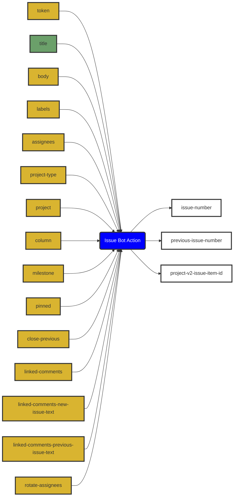

# Issue Bot
> GitHub Actions powered Issue Bot 🦾

<p align="center">
  
  
  
  
</p>

## About

Work on a distributed team? Try using Issue Bot as a Scrum [standup](https://en.wikipedia.org/wiki/Stand-up_meeting) process automation bot to keep track of what you're all working on. 🤖

Have repeated tasks you're setting reminders for elsewhere? Issue Bot's got your back there, too. 👏

Or just need an issue created on a certain condition? Issue Bot is there when your CI build breaks. 💔

Issue Bot is a flexible GitHub action that takes care of a few issue related tasks:
- Opens new issue with `title`, `body`, `labels`, and `assignees`
- Uses [Mustache templating syntax](https://github.com/janl/mustache.js) in `body`, along with a couple of handy template variables: `assignees` and `previousIssueNumber`
- Closes most recent previous issue with all `labels` if `close-previous` is true
- Adds new issue to `project` (user, organization, or repository project based on value of `project-type`), `column`, and `milestone`
- Adds new issue to user or organization project at `project-v2-path`
- Pins new issue and unpins previous issue if `pinned` is true
- Makes issue comments linking new and previous issues if `linked-comments` is true
- Assigns new issue only to the _next_ assignee in the list if `rotate-assignees` is true. Useful for duty rotation like first responder.
- Pairs well with [imjohnbo/extract-issue-template-fields](https://github.com/imjohnbo/extract-issue-template-fields) if you'd prefer to open issues based on [issue templates](https://docs.github.com/en/github/building-a-strong-community/about-issue-and-pull-request-templates#issue-templates)

## v3 Migration
⚠️ If you're a `v2` user, please note that these breaking changes were introduced in `v3`: ⚠️
- `template` functionality has been moved to a separate action: https://github.com/imjohnbo/extract-issue-template-fields.
- `labels` now checks if **all** labels match. Before, it checked if **any** labels matched.

and these features were added 🎉:
- `project` and `column` for adding an issue to a [repository project board](https://docs.github.com/en/github/managing-your-work-on-github/about-project-boards).
- `milestone` for adding an issue to a [milestone](https://docs.github.com/en/github/managing-your-work-on-github/tracking-the-progress-of-your-work-with-milestones).

As always, your feedback and [contributions](#contributing) are welcome.

## Usage

Simple example:
```yml
# ...
- name: Create new issue
  uses: imjohnbo/issue-bot@v3
  with:
    assignees: "octocat, monalisa"
    title: Hello, world
    body: |-
      :wave: Hi, {{#each assignees}}@{{this}}{{#unless @last}}, {{/unless}}{{/each}}!
    pinned: true
# ...
```

For more examples, see a [GitHub-wide search](https://github.com/search?q=%22uses%3A+imjohnbo%2Fissue-bot%22&type=code) or [./docs/example-workflows](docs/example-workflows/):
- [Daily standup bot](docs/example-workflows/standup.yml)
- [Repeated tasks](docs/example-workflows/scheduled-task.yml)
- [Duty rotation](docs/example-workflows/first-responder.yml)
- [Ad hoc after broken CI build](docs/example-workflows/broken-build.yml)

## Inputs and outputs

See [action.yml](action.yml) for full description of inputs and outputs.

Generated by [`imjohnbo/action-to-mermaid`](https://github.com/imjohnbo/action-to-mermaid):

<!-- START MERMAID -->

<!-- END MERMAID -->

## Template variables

The issue body is treated as a [Handlebars](https://handlebarsjs.com) template, with support for template variables:

- `assignees`: The array of issue assignees.
- `previousIssueNumber`: The previous issue number in the series.

The linked comments (`linked-comments-new-issue-text`, `linked-comments-previous-issue-text`) support these variables _and_:

- `newIssueNumber`: The new issue number.

## Authentication

Issue Bot requires an API token, customizable with the [`token` input](https://github.com/imjohnbo/issue-bot/blob/46d9bc985d7f6952b5f439f929761b9c24ed0903/action.yml#L9), to authenticate with the GitHub API. The default `GITHUB_TOKEN` should work for all use cases except `project` and `project-v2-path`, when its [permissions](https://docs.github.com/en/actions/security-guides/automatic-token-authentication#permissions-for-the-github_token) aren't sufficient. Please use a [GitHub App installation access token](https://docs.github.com/en/developers/apps/building-github-apps/authenticating-with-github-apps#authenticating-as-an-installation) of a GitHub App with `repository/project:read-write`/`organization/project:read-write` scope or [personal access token](https://docs.github.com/en/authentication/keeping-your-account-and-data-secure/creating-a-personal-access-token) with `project` scope in these cases. 

GitHub Apps are in general [pretty cool](https://dev.to/github/building-github-apps-for-fun-and-profit-4mid) and offer some [nice advantages](https://docs.github.com/en/developers/apps/getting-started-with-apps/about-apps) over personal access tokens, so they're preferred when possible. 

GitHub App installation access token:
```yml
# ...

# Generate installation token for your GitHub App with...you guessed it, an action
# See https://github.com/tibdex/github-app-token for setup
- name: Generate token
  id: generate_token
  uses: tibdex/github-app-token@v1
  with:
    app_id: ${{ secrets.APP_ID }}
    private_key: ${{ secrets.PRIVATE_KEY }}

# New standup issue generated with a GitHub App!
- name: New standup issue
  uses: imjohnbo/issue-bot@v3
  env:
    TOKEN: ${{ steps.generate_token.outputs.token }} # installation access token as output of previous step
  with:
    title: Standup
    body: |-
      ... standup template ...
    token: ${{ env.TOKEN }}

# ...
```

Personal access token:
```yml
# ...

# New standup issue generated with a personal access token
- name: New standup issue
  uses: imjohnbo/issue-bot@v3
  with:
    title: Standup
    body: |-
      ... standup template ...
    token: ${{ env.PAT }}

# ...
```

## Projects support

Issue Bot currently supports [Projects](https://docs.github.com/en/issues/planning-and-tracking-with-projects/learning-about-projects/about-projects) (a.k.a. Projects v2, Projects Beta, and Projects Next) (`project-v2-path`) and [Projects (classic)](https://docs.github.com/en/issues/organizing-your-work-with-project-boards/managing-project-boards/about-project-boards) (`project`, `project-type`, `column`, and `milestone`). See [`action.yml`](action.yml) for more details about these inputs.

Except when adding an issue to a Projects (classic) repository board, where the [built in `github.token`'s](https://github.com/imjohnbo/issue-bot/blob/main/action.yml#L13) permissions suffice, it's recommended to use a GitHub App installation access token or personal access token with the proper scopes.

Support for Projects (classic) will be dropped in a future version.


## Contributing

Feel free to open an issue, or better yet, a
[pull request](https://github.com/imjohnbo/issue-bot/compare)!

## License

[MIT](LICENSE)
