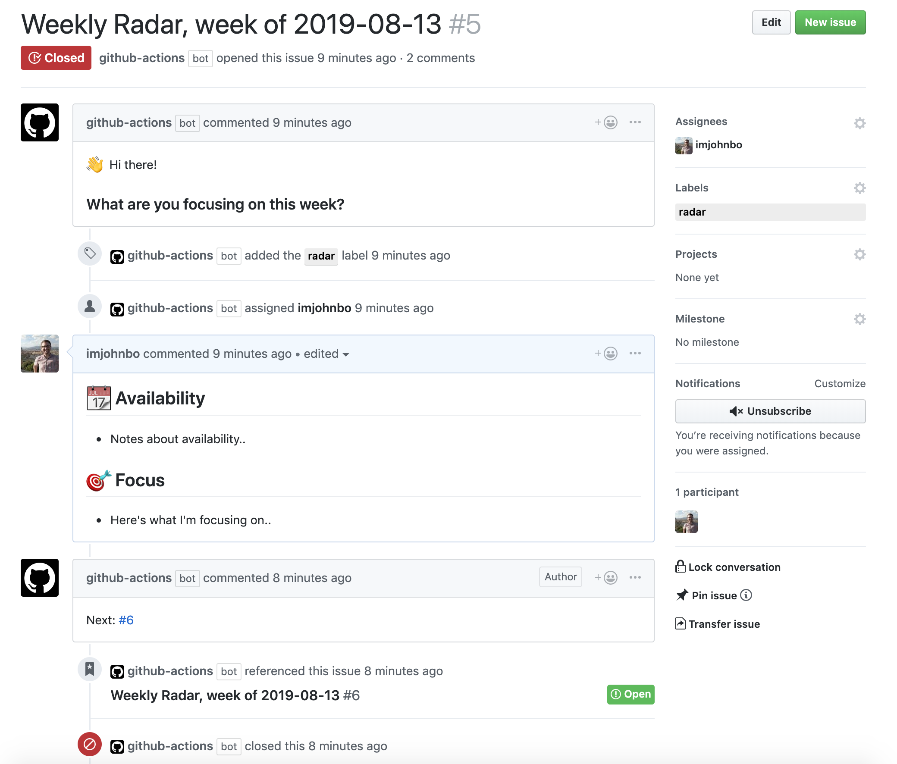

# Weekly Radar

## Usage

Work on a distributed team? Try using Weekly Radar as a [stand up](https://en.wikipedia.org/wiki/Stand-up_meeting) process automation bot to keep track of what you're all working on. 🚀

Weekly Radar is GitHub Action that will find the first open issue with `label`,
close it, and link it to a newly created Weekly Radar template issue. If there
is no open issue with `label`, it will create one. It will also assign the
new issue to `assignees` and [pin the issue](https://help.github.com/en/github/managing-your-work-on-github/pinning-an-issue-to-your-repository) (`pinned` = `true`) for easier access.

**Example workflow**:

```
name: Weekly Radar
on:
  schedule:
  - cron: 0 12 * * 1  # Midnight on Monday – https://crontab.guru

jobs:
  weekly_radar:
    name: Close Old and Open New Weekly Radar
    runs-on: ubuntu-latest
    steps:

    - name: weekly-radar
      uses: imjohnbo/weekly-radar@master
      with:
        assignees: "some space delimited list of assignees"
        label: "my-custom-label"
        pinned: true
      env:
        GITHUB_TOKEN: ${{ secrets.GITHUB_TOKEN }}
```

**In action**:



## Miscellaneous

- `schedule(*,*,*,*,*)` is just
  [one option](https://help.github.com/en/articles/events-that-trigger-workflows#scheduled-events)
  based on POSIX cron syntax. Knock yourself out by instead responding to
  [events](https://help.github.com/en/articles/events-that-trigger-workflows)!

## Inputs

- `assignees` (optional) is a space delimited list of assignees for the Weekly
  Radar.
- `label` (optional) is the label to be attached to the Weekly Radar.
- `pinned` (optional) is a boolean flag that [pins the issue](https://help.github.com/en/github/managing-your-work-on-github/pinning-an-issue-to-your-repository) to your repository for easier access.

## Environment variables

- `GITHUB_TOKEN` is assigned the
  [automatically-generated GitHub token](https://help.github.com/en/articles/virtual-environments-for-github-actions#creating-and-using-secrets-encrypted-variables)
  that is scoped for the repository whose workflow calls the Action.

## Contributing

Feel free to open an issue, or better yet, a
[pull request](https://github.com/imjohnbo/weekly-radar/compare)!

## License

[MIT](https://choosealicense.com/licenses/mit/)
