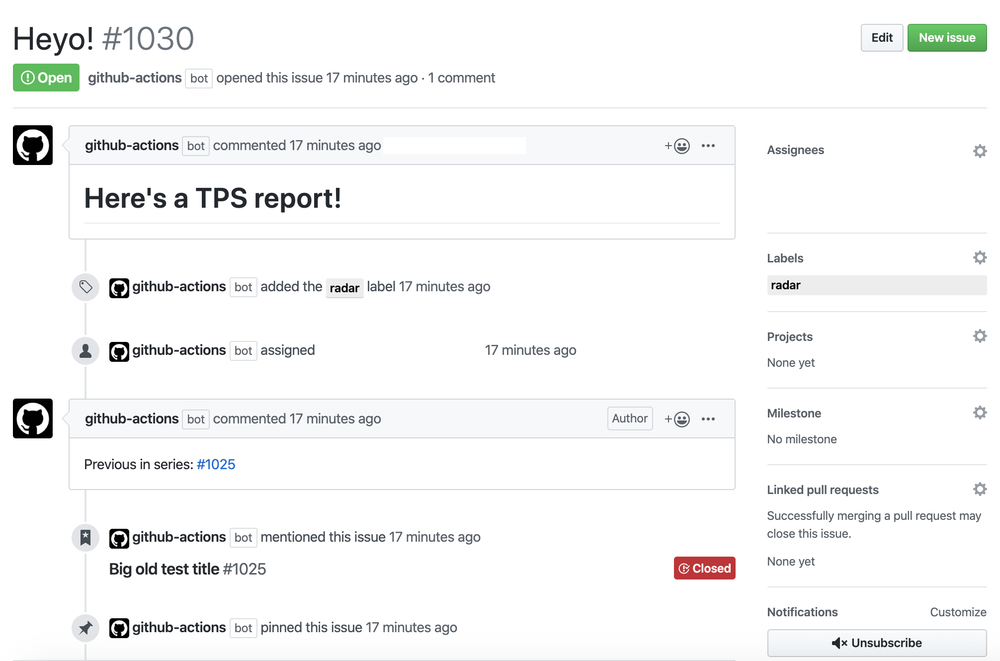

# Issue Bot

## About

Work on a distributed team? Try using Issue Bot as a Scrum [standup](https://en.wikipedia.org/wiki/Stand-up_meeting) process automation bot to keep track of what you're all working on. 🤖

Have repeated tasks you're setting reminders for elsewhere? Issue Bot's got your back there, too. 👏

Or just need an issue created on a certain condition? Issue Bot is there when your CI build breaks. 💔

Issue Bot is a flexible GitHub Action that will open a new issue based on `input` values issue template of your choice. You can make it close the most recent one of its type, you can pin it, and since it's open source, [pull requests](https://github.com/imjohnbo/issue-bot/compare) are welcome!

## Usage

As a daily standup bot:

```yml
name: Daily Standup
on:
  schedule:
  - cron: 0 12 * * *  # Every day at noon – https://crontab.guru

jobs:
  daily_standup:
    name: Daily Standup
    runs-on: ubuntu-latest
    steps:

    # Repo code checkout required if `template` is used
    - name: Checkout
      uses: actions/checkout@v2

    - name: issue-bot
      uses: imjohnbo/issue-bot@v2
      with:
        assignees: "comma, delimited, list, of, handles" # GitHub handles without the @
        labels: "standup"
        pinned: true
        close-previous: true
        template: ".github/ISSUE_TEMPLATE/standup.md" # assignees, labels will be overridden if present in YAML header
      env:
        GITHUB_TOKEN: ${{ secrets.GITHUB_TOKEN }}
```

To keep track of repeated tasks:

```yml
name: Generate TPS reports
on:
  schedule:
  - cron: 0 0 1 * *  # First of every month – https://crontab.guru

jobs:
  tps_reports:
    name: TPS reports
    runs-on: ubuntu-latest
    steps:

    # Repo code checkout required if `template` is used
    - name: Checkout
      uses: actions/checkout@v2

    - name: issue-bot
      uses: imjohnbo/issue-bot@v2
      with:
        assignees: "me"     # your GitHub handle without the @
        labels: "tps, bug"
        pinned: false
        close-previous: false
        template: "tps.md"
      env:
        GITHUB_TOKEN: ${{ secrets.GITHUB_TOKEN }}
```

Or just downstream of a failed CI step 💔:

```yml
name: Continuous Integration
on:
  [push, pull_request]

jobs:
  ci:
    name: CI
    runs-on: ubuntu-latest
    steps:

    # Repo code checkout required if `template` is used
    - name: Checkout
      uses: actions/checkout@v2

    - name: CI
      run: |
        echo "...these are some CI steps..."

    - name: issue-bot
      if: failure()
      uses: imjohnbo/issue-bot@v2
      with:
        assignees: "handles, of, my, teammates"    # GitHub handles without the @
        label: "ci"
        pinned: false
        close-previous: false
        template: "ci-failure.md"
      env:
        GITHUB_TOKEN: ${{ secrets.GITHUB_TOKEN }}
```


**In action**:



## Inputs

- `labels`: Comma delimited list of issue labels. Required value either as input or in YAML header of issue template.
- `title`: Issue title. Required value either as input or in YAML header of issue template.
- `assignees`: Comma delimited list of issue assignees.
- `rotate-assignees`: 
- `body`: Issue body.
- `pinned`: Whether to [pins the issue](https://help.github.com/en/github/managing-your-work-on-github/pinning-an-issue-to-your-repository) and unpin the previous one.
- `close-previous`: Whether to close the most recent previous issue with a matching label.
- `linked-comments`: Whether to link a previous issue in a series to the next issue via a comment on the previous issue.
- `template`: Path to template used in issue, eg. `.github/ISSUE_TEMPLATE/bug_report.md`. Can also be a normal Markdown file with no YAML header (converted to `body`), in which case, `labels`, `title`, and `assignees` can be provided as inputs.

## Outputs

- `issue-number`: new issue number, if successfully created.

## Environment variables

- `GITHUB_TOKEN` (required): should be assigned the
  [automatically-generated GitHub token](https://help.github.com/en/articles/virtual-environments-for-github-actions#creating-and-using-secrets-encrypted-variables)
  that is scoped for the repository whose workflow calls the Action.

## Template variables

The issue body is treated as a [Handlebars](https://handlebarsjs.com) template, with support for template variables:

- `previousIssueNumber`: The previous issue number in the series.

## Contributing

Feel free to open an issue, or better yet, a
[pull request](https://github.com/imjohnbo/issue-bot/compare)!

## License

[MIT](https://choosealicense.com/licenses/mit/)
