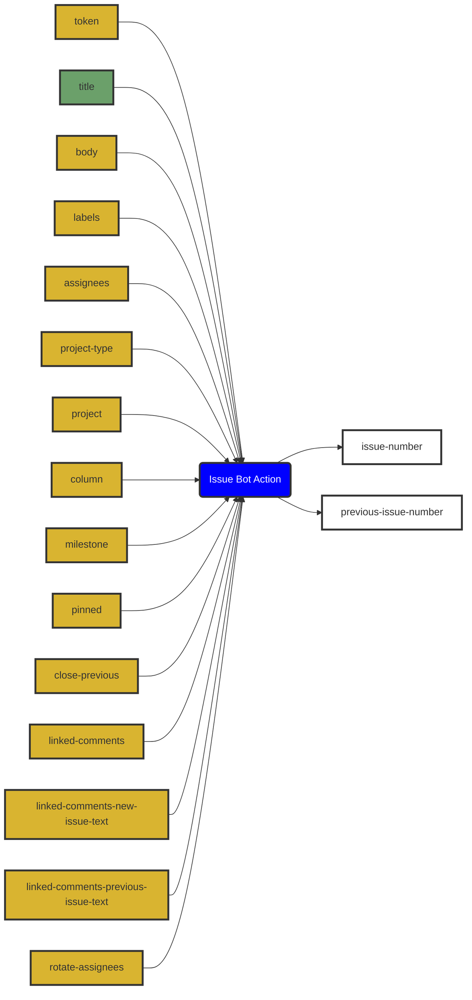

```mermaid
flowchart LR
token:::optional-->action(Issue Bot Action):::action
title:::required-->action(Issue Bot Action):::action
body:::optional-->action(Issue Bot Action):::action
labels:::optional-->action(Issue Bot Action):::action
assignees:::optional-->action(Issue Bot Action):::action
project-type:::optional-->action(Issue Bot Action):::action
project:::optional-->action(Issue Bot Action):::action
column:::optional-->action(Issue Bot Action):::action
milestone:::optional-->action(Issue Bot Action):::action
pinned:::optional-->action(Issue Bot Action):::action
close-previous:::optional-->action(Issue Bot Action):::action
linked-comments:::optional-->action(Issue Bot Action):::action
linked-comments-new-issue-text:::optional-->action(Issue Bot Action):::action
linked-comments-previous-issue-text:::optional-->action(Issue Bot Action):::action
rotate-assignees:::optional-->action(Issue Bot Action):::action
action(Issue Bot Action)-->issue-number:::output
action(Issue Bot Action)-->previous-issue-number:::output
classDef required fill:#6ba06a,stroke:#333,stroke-width:3px
classDef optional fill:#d9b430,stroke:#333,stroke-width:3px
classDef action fill:blue,stroke:#333,stroke-width:3px,color:#ffffff
classDef output fill:#fff,stroke:#333,stroke-width:3px,color:#333
click token "https://github.com/imjohnbo/issue-bot/blob/main/action.yml#L9"
click title "https://github.com/imjohnbo/issue-bot/blob/main/action.yml#L15"
click body "https://github.com/imjohnbo/issue-bot/blob/main/action.yml#L20"
click labels "https://github.com/imjohnbo/issue-bot/blob/main/action.yml#L25"
click assignees "https://github.com/imjohnbo/issue-bot/blob/main/action.yml#L30"
click project-type "https://github.com/imjohnbo/issue-bot/blob/main/action.yml#L36"
click project "https://github.com/imjohnbo/issue-bot/blob/main/action.yml#L11"
click column "https://github.com/imjohnbo/issue-bot/blob/main/action.yml#L49"
click milestone "https://github.com/imjohnbo/issue-bot/blob/main/action.yml#L55"
click pinned "https://github.com/imjohnbo/issue-bot/blob/main/action.yml#L60"
click close-previous "https://github.com/imjohnbo/issue-bot/blob/main/action.yml#L67"
click linked-comments "https://github.com/imjohnbo/issue-bot/blob/main/action.yml#L74"
click linked-comments-new-issue-text "https://github.com/imjohnbo/issue-bot/blob/main/action.yml#L82"
click linked-comments-previous-issue-text "https://github.com/imjohnbo/issue-bot/blob/main/action.yml#L89"
click rotate-assignees "https://github.com/imjohnbo/issue-bot/blob/main/action.yml#L96"
click issue-number "https://github.com/imjohnbo/issue-bot/blob/main/action.yml#L104"
click previous-issue-number "https://github.com/imjohnbo/issue-bot/blob/main/action.yml#L107"
```
